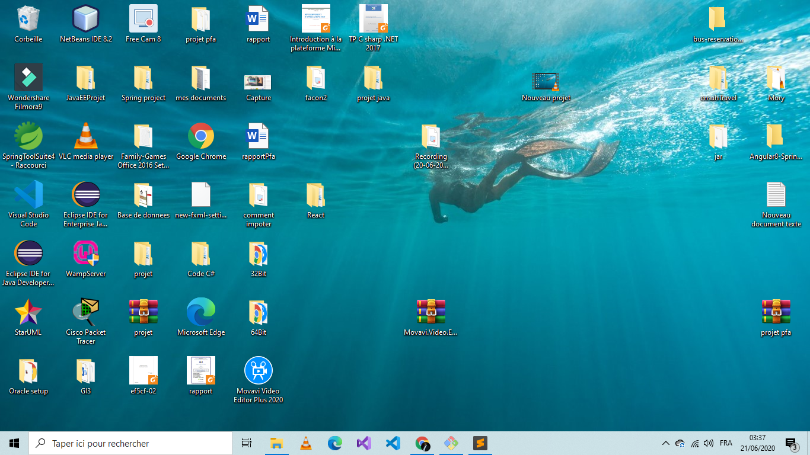

# E n s a h V i s i o n
<p align="center">
 </div>
</p>

EnsahVision est une application de vision par ordinateur intelligente dotée de diverses fonctionnalités. On a  essayé de mettre autant d'outils de Machine Learning que possible dans une seule application pour une plus grande productivité.

## PRINCIPALES CARACTERISTIQUES
* Système de présence automatique utilisant la reconnaissance faciale en temps réel
* Entraîneur de visage
* Détection de mouvement
* OCR (lecteur optique de caractères)
* L'accée aux réseaux sociaux aprés la reconnaissance
* Détection de forme rectangulaire
* Galerie d'images de visages formés
* Détection des yeux
* Stockage persistant pour l'image de visages formés à l'aide de la base de données

## TECHNOLOGIES UTILISÉES
* Core Java
* JavaCV (wrapper of Opencv )
* JavaFX
* MySQL
* Maven
* Tesseract OCR Framework


## USER INTERFACE


# Installation Guide


### Video Guide


[](https://www.youtube.com/embed/Wzwc4RUJs1Y "Video Title")

### IDE
```bash
  On a développé ce projet en utilisant Eclipse.Nous  vous recommandons donc fortement d'utiliser cet IDE particulier.
   ```
   
## Maven Dependencies
```xml
     <dependency>
  	    <groupId>org.bytedeco</groupId>
  	    <artifactId>javacv-platform</artifactId>
  	    <version>1.3.2</version>
      </dependency>
  
      <dependency>
           <groupId>mysql</groupId>
           <artifactId>mysql-connector-java</artifactId>
           <version>5.1.14</version>
      </dependency>

      <dependency>
            <groupId>org.bytedeco.javacpp-presets</groupId>
            <artifactId>tesseract-platform</artifactId>
            <version>3.04.01-1.3</version>
      </dependency>
      <dependency>
            <groupId>org.bytedeco.javacpp-presets</groupId>
            <artifactId>opencv</artifactId>
            <version>3.2.0-1.3</version>
      </dependency>
    <!-- https://mvnrepository.com/artifact/de.jensd/fontawesomefx -->
      <dependency>
          <groupId>de.jensd</groupId>
          <artifactId>fontawesomefx</artifactId>
          <version>8.9</version>
      </dependency>
    <!-- https://mvnrepository.com/artifact/com.jfoenix/jfoenix -->
      <dependency>
          <groupId>com.jfoenix</groupId>
          <artifactId>jfoenix</artifactId>
          <version>9.0.1</version>
      </dependency>

  ```
  
### Required Software
To properly run this Application on your System, At first you need to download and install the following software:

 * An implementation of **Java SE** 7 or newer:
   * **JDK**  http://www.oracle.com/technetwork/java/javase/downloads/index.html
 
 * An implementation of **JavaFX**: (Follow The Installation Instruction)
   * **JavaFX**  https://docs.oracle.com/javafx/2/installation/jfxpub-installation.htm

 * An implementation of **JavaCV**: (Follow The Installation Instruction)
   * **JavaCV**  https://github.com/bytedeco/javacv
   
 * An implementation of **MySQL Database**: 
   * **WAMPSERVER**  https://www.wampserver.com/
 
 * To Connect MySQL with Java, You will need a connector: (Follow the installation instruction)
   * **MySQL Connector Java**  https://dev.mysql.com/downloads/connector/j/5.1.html
  
 * An implementation of **JavaFX Scene Builder**: (Follow The Installation Instruction)
   * **JavaFX Scene Builder**  https://docs.oracle.com/javafx/scenebuilder/1/installation_1-0/jsbpub-installation_1-0.htm
 

Finally, please make sure everything has the same bitness: **32-bit and 64-bit modules do not mix under any circumstances**.


# Paramètres de configuration
#### EnsahVision peut ne pas fonctionner correctement sans ces paramètres
#### Avant d'exécuter l'application, vous devez apporter des modifications aux fichiers mentionnés ci-dessous ...

## Paramètres de la base de données 
* Open MySQL on XAMPP then Create a New Database & name it **ghostEye** 
* Now import attached **face_bio.sql** to the  **ghostEye** Database
* Or Create a New Schema(Table)
```sql

CREATE TABLE IF NOT EXISTS `face_bio` (
`id` int(11) NOT NULL,
  `code` int(10) NOT NULL,
  `first_name` varchar(30) NOT NULL,
  `last_name` varchar(20) NOT NULL,
  `reg` int(10) NOT NULL,
  `age` int(10) NOT NULL,
  `section` varchar(20) NOT NULL
) ENGINE=InnoDB AUTO_INCREMENT=1 DEFAULT CHARSET=latin1;


ALTER TABLE `face_bio`
 ADD PRIMARY KEY (`id`);
 
 ALTER TABLE `face_bio`
MODIFY `id` int(11) NOT NULL AUTO_INCREMENT,AUTO_INCREMENT=1;

```

* Now Open src/application/Database.java and provide your MySQL DB credintials
```java
package application;

import java.sql.*;
import java.util.ArrayList;
import java.util.List;

class Database {
	public int code;

	public String fname;
	public String Lname;
	public int reg;
	public int age;
	public String sec;

	public final String Database_name = "Your Database";
	public final String Database_user = "Your Database user Name";
	public final String Database_pass = "Your Database Password";

	.
	.
	.
```
##Paramètres OCR
* Pour utiliser l'api tesseract, vous devez d'abord installer tesseract avec les données de formation linguistique souhaitées sur votre système, après quoi vous devez mentionner le dossier d'installation.

```java
Now goto src/application/OCR.java ,in line 36 provide your tesseract installation directory name.
```

# Tips
* Lorsque vous allez former un nouveau visage, essayez de capturer au moins 10 photos d'une seule personne sous un angle différent.Gardez à l'esprit que plus il y a d'images d'entraînement sous différents angles et postures, plus la reconnaissance du visage sera précise.
* Après tout, videz gentiment le dossier ** faces **. Il y a une image test_face. Vous devez la supprimer.

#  Note:
Veuillez garder cela à l'esprit, parfois l'algorithme de reconnaissance faciale fournit une sortie erronée si une personne n'est pas formée ou inconnue du système.La raison derrière cela est que l'algorithme de reconnaissance faciale devine le visage avec la correspondance la plus proche. match, le système sélectionne n'importe quel visage avec un match le plus proche.C'est pourquoi il fournit parfois une sortie incorrecte.

# LICENCE

```licence

MIT License

Copyright (c) 2020 mory, asmae, manal

La permission est accordée, gratuitement, à toute personne obtenant une copie
de ce logiciel et des fichiers de documentation associés (le "Logiciel"), pour traiter
dans le Logiciel sans restriction, y compris sans limitation les droits
utiliser, copier, modifier, fusionner, publier, distribuer, sous-licencier et / ou vendre
des copies du logiciel et pour permettre aux personnes à qui le logiciel est
fourni à cet effet, sous réserve des conditions suivantes:

L'avis de droit d'auteur ci-dessus et cet avis d'autorisation doivent être inclus dans tous les
copies ou parties substantielles du Logiciel.

LE LOGICIEL EST FOURNI "TEL QUEL", SANS GARANTIE D'AUCUNE SORTE, EXPRESSE OU
IMPLICITE, Y COMPRIS, MAIS SANS S'Y LIMITER, LES GARANTIES DE QUALITÉ MARCHANDE,
ADAPTATION À UN USAGE PARTICULIER ET NON-CONTREFAÇON. EN AUCUN CAS, LE
LES AUTEURS OU LES DÉTENTEURS DE DROITS D'AUTEUR SONT RESPONSABLES DE TOUTES RÉCLAMATIONS, DOMMAGES OU AUTRES
RESPONSABILITÉ, QUE CE SOIT DANS UNE ACTION DE CONTRAT, TORT OU AUTRE, DÉCOULANT DE,
HORS OU EN LIEN AVEC LE LOGICIEL OU L'UTILISATION OU AUTRES OPÉRATIONS DANS LE
LOGICIEL.

```

       

 


